<picture>
  <source media="(prefers-color-scheme: dark)" srcset="./assets/dark.svg">
  <source media="(prefers-color-scheme: light)" srcset="./assets/light.svg">
  
</picture>

  <a href="https://github.com/ColorblindReaper">GitHub</a>
  ·
  <a href="https://www.linkedin.com/in/daniel-myagkov-618a61284/">LinkedIn</a>
  ·
  <a href="https://t.me/DrownxD">Telegram</a>

